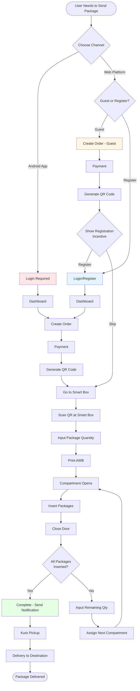
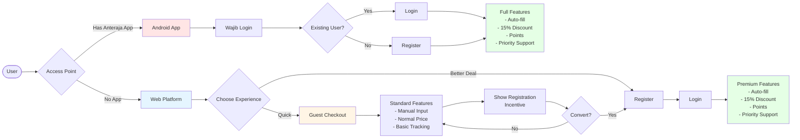
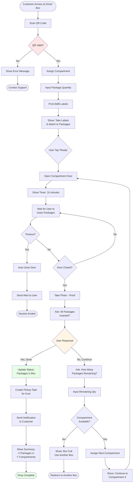
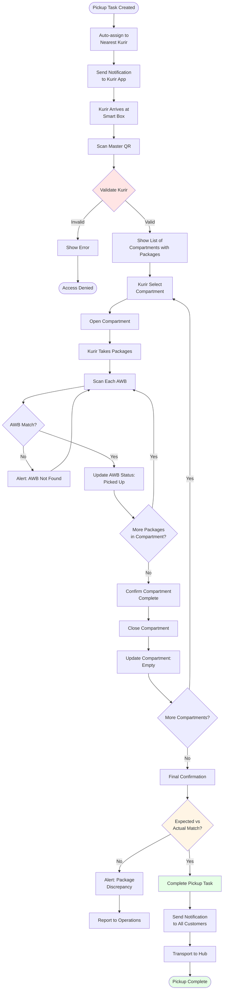
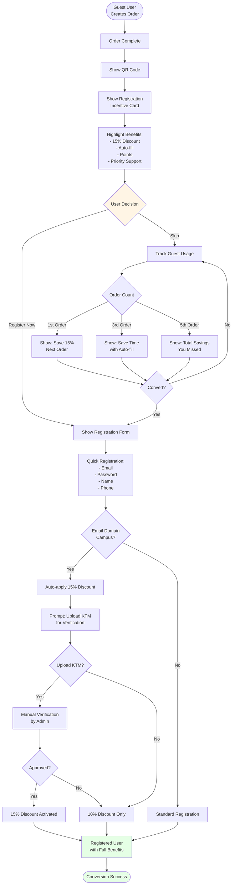
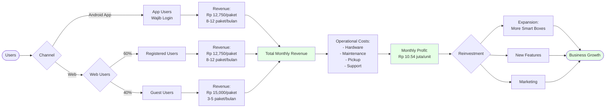
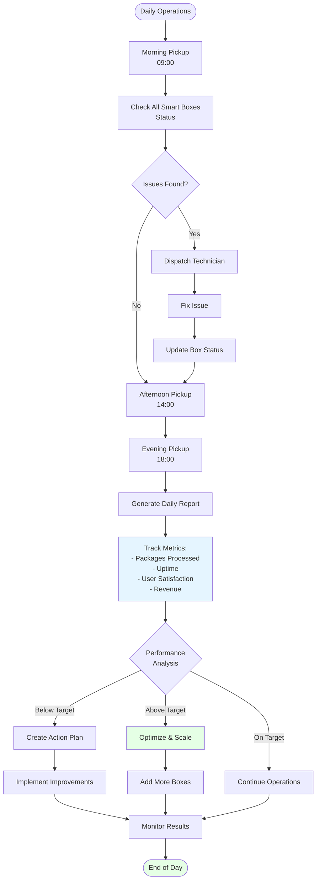
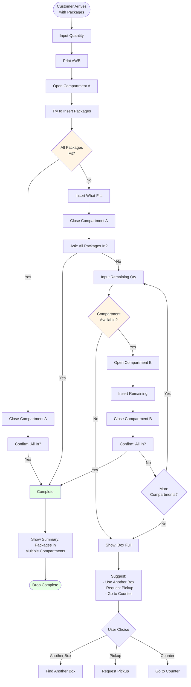

# Anteraja Campus HUB - Business Flowcharts

## 📊 Complete Business Flow Diagrams

---

## 1. Overall User Journey Flow

---

## 2. Channel Strategy Flow

---

## 3. Smart Box Drop Package Flow (Detailed)

---

## 4. Kurir Pickup Flow

---

## 5. Guest to Registered Conversion Flow

---

## 6. Revenue Flow

---

## 7. Operations Flow

---

## 8. Decision Tree: Package Size Handling

---

## Legend

- 🟢 **Green**: Success/Complete states
- 🟡 **Yellow**: Decision points
- 🔴 **Red**: Error/Issue states
- ⚪ **White**: Process steps

---

**Document Version**: 1.0
**Last Updated**: November 2025
**Owner**: Product Team - Anteraja Campus HUB

**Note**: These flowcharts can be rendered using Mermaid-compatible tools like:
- GitHub (native support)
- Mermaid Live Editor (https://mermaid.live)
- VS Code with Mermaid extension
- Notion, Confluence, etc.
